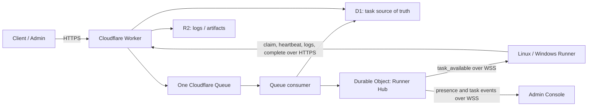

# Task Hub

Task Hub is a Cloudflare-hosted asynchronous task execution platform. External systems submit tasks to the Worker API and specify the exact `runnerId` that must execute the task. A Linux or Windows Runner keeps an outbound WebSocket for wake notifications, claims only its own tasks over HTTPS, executes a locally registered handler, and reports logs, status, and results back to Cloudflare.

The repository is split into three layers:

- `src/worker`: Cloudflare Worker API, queue consumer, and task state machine.
- `runner/taskhub_runner`: Python Runner runtime.
- `runner/handlers`: local handler plugins loaded from `handler.json` manifests.

## Architecture

- **Task API:** Cloudflare Worker TypeScript endpoints for submit, query, runner registration, claim, heartbeat, logs, and completion.
- **Cloudflare Queues:** submission buffer. The Worker enqueues accepted tasks; the Queue consumer moves them into `pending_runner` after validation.
- **D1:** task, runner, attempt, and webhook delivery metadata.
- **R2:** log batches and large result artifacts.
- **Durable Object:** one global hibernatable WebSocket hub for Runner wake notifications, live presence, and admin events.
- **Runner:** Python daemon/service that uses only outbound HTTPS/WSS.
- **Task Handler:** local Runner plugins. Ubuntu installs enable `selfcheck` by default; task-specific handlers such as registered-script Shell are installed on demand.
- **Admin Console:** the Worker-hosted `/admin` page lists runners and tasks, receives presence/task changes over WebSocket, reads task logs, and submits `selfcheck` tasks.



## Task Flow

1. Client calls `POST /tasks` with a required `runnerId`.
2. Worker stores the task as `queued` and sends `{ taskId }` to Cloudflare Queues.
3. Queue consumer validates the target Runner and task type.
4. Valid work moves to `pending_runner`, then the consumer sends `task_available` to the target Runner through the Durable Object hub.
5. The notified Runner calls `POST /runners/:runnerId/claim` with its bearer credential. A 9-11 minute fallback claim recovers missed notifications.
6. Worker returns a 90-second lease only for tasks assigned to that Runner.
7. Runner executes the handler in a per-task workspace and renews the lease every 20 seconds.
8. Runner uploads logs and calls `POST /tasks/:taskId/complete`.
9. Worker records terminal state, broadcasts the change to admin connections, and creates a signed webhook delivery record when `callbackUrl` is present.

## API Shape

Submit:

```json
{
  "runnerId": "runner_linux_01",
  "type": "shell",
  "name": "nightly backup",
  "payload": { "scriptId": "backup-home" },
  "timeoutSeconds": 1800,
  "priority": 5,
  "callbackUrl": "https://example.com/task-callback",
  "idempotencyKey": "backup-2026-06-11"
}
```

Runner registration:

```json
{
  "name": "Build server",
  "credential": "runner-secret",
  "platform": "linux",
  "labels": ["prod"],
  "taskTypes": ["selfcheck"],
  "capabilities": ["runner.selfcheck"]
}
```

`runnerId` is optional during registration. When omitted, the Worker returns a generated ID that the installer stores locally. Supply `runnerId` when an operator-controlled stable ID is required. The registration response is:

```json
{
  "runnerId": "runner_7db26f65-2ab1-4b60-9967-a9a1ca9e1844",
  "name": "Build server"
}
```

## Admin Console

Open `https://<worker-host>/admin` and connect with `TASK_HUB_ADMIN_TOKEN`. The token remains in browser `sessionStorage` and is sent only as a Bearer token to `/api/admin/*`.

Management endpoints:

```text
GET  /api/admin/runners
GET  /api/admin/runners/:runnerId
GET  /api/admin/tasks
POST /api/admin/tasks
GET  /api/admin/tasks/:taskId
GET  /api/admin/tasks/:taskId/logs
POST /api/admin/events-ticket
GET  /api/admin/events
GET  /api/admin/presence
```

The Admin Console uses the Durable Object's live WebSocket presence as the authoritative online indicator. Stored `online`/`stale`/`offline` values remain available as last-activity information when no live presence snapshot is available.

Handler manifest:

```json
{
  "name": "builtin-shell",
  "version": "1.0.0",
  "taskTypes": ["shell"],
  "platforms": ["linux", "windows"],
  "capabilities": ["shell.registered_scripts"],
  "entrypoint": "handlers.shell:ShellHandler",
  "timeoutMaxSeconds": 3600
}
```

## Local Verification

Install dependencies:

```powershell
npm.cmd install
```

Run all tests:

```powershell
npm.cmd test
```

Run Worker tests only:

```powershell
npm.cmd run test:worker
```

Run Runner tests only:

```powershell
npm.cmd run test:runner
```

## Running a Runner

Create local config files from the examples:

```powershell
copy runner\config\runner.example.json runner\config\runner.json
copy runner\config\scripts.example.json runner\config\scripts.json
set TASK_HUB_RUNNER_TOKEN=replace-with-runner-secret
```

Run one poll:

```powershell
set PYTHONPATH=runner&& python -m taskhub_runner.cli --config runner\config\runner.json --once
```

Run continuously:

```powershell
set PYTHONPATH=runner&& python -m taskhub_runner.cli --config runner\config\runner.json
```

Ubuntu one-line installs enable the `selfcheck` handler first. Install the `shell` handler on demand when registered scripts are needed. Shell tasks must reference a registered `scriptId`; arbitrary shell command payloads are intentionally rejected.

## Cloudflare Setup

1. Create a D1 database, R2 bucket, and Queue. The first Worker deploy creates the SQLite-backed Durable Object class from migration tag `v1`.
2. Copy `cloudflare/wrangler.toml.template` to `wrangler.toml` for local deploys and replace placeholders.
3. Apply all D1 migrations in `cloudflare/migrations`.
4. Set `WEBHOOK_SECRET`, `RUNNER_REGISTRATION_TOKEN`, and `TASK_HUB_ADMIN_TOKEN` as Worker secrets.
5. Deploy with Wrangler.

The current implementation contains the deployable Worker bindings and queue consumer, plus a tested in-memory store for unit tests.

## GitHub Actions Deployment

Configure these repository secrets before using the workflows:

```text
CLOUDFLARE_API_TOKEN
CLOUDFLARE_ACCOUNT_ID
RUNNER_REGISTRATION_TOKEN
TASK_HUB_ADMIN_TOKEN
```

Set all Worker secrets before production use:

```powershell
npx wrangler secret put WEBHOOK_SECRET
npx wrangler secret put RUNNER_REGISTRATION_TOKEN
npx wrangler secret put TASK_HUB_ADMIN_TOKEN
```

The credential-hashing migration changes how Runner credentials are verified. Re-run registration once for every existing Runner after deploying this version; the Runner ID remains unchanged.

The deploy workflow publishes `WEBHOOK_SECRET`, `RUNNER_REGISTRATION_TOKEN`, and `TASK_HUB_ADMIN_TOKEN` from GitHub Secrets during deployment. A missing value remains fail-closed at runtime.

The repository includes two workflows:

- `.github/workflows/bootstrap-cloudflare.yml`: manually creates the Queue, D1 database, and R2 bucket named by GitHub Variables.
- `.github/workflows/deploy-worker.yml`: on pushes to `main`, generates `wrangler.toml` from GitHub Variables, runs `npm ci`, `npm test`, applies D1 migrations, and deploys the Worker.

After running the bootstrap workflow, copy resource names and IDs into GitHub Variables. The bootstrap workflow is intentionally manual because Cloudflare resource creation commands are not meant to run on every push.

See `docs/configuration.md`, `docs/deployment.md`, and `docs/runner-handlers.md` for the full configuration model.
